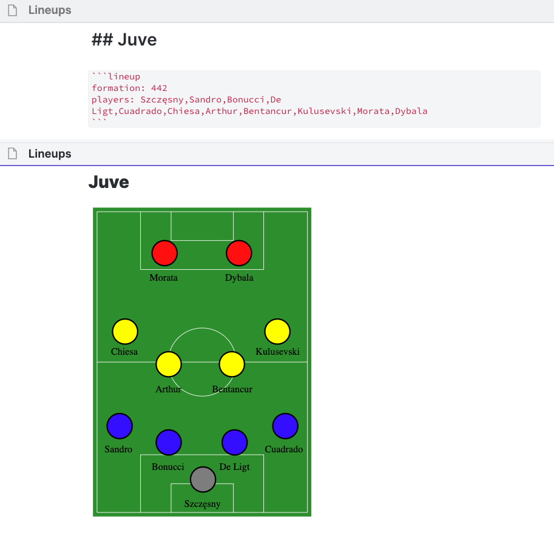

# Obsidian Lineup Builder Plugin


This plugin allows you to build football lineups in Obsidian by specifying a formation and a list of players.

The lineup is defined in a codeblock and is visible in Preview mode.
  

## Using the Plugin

To create a lineup you need to define a `lineup` codeblock with the following options:
  
### Formation

The `formation` option is one of the currently available formations:

- 433
- 4231
- 442
- 442-diamond

### Players

The `players` option defines the starting 11, ordered from bottom to top and left to right.

i.e. for a 433: Mendy,Chilwell,Silva,Rudiger,James,Mount,Jorginho,Kante,Werner,Lukaku,Havertz
  

### Example

````
```lineup
formation: 4231
players: Kepa,Chilwell,Silva,Rudi,Azpi,Kante,Kovacic,CHO,Mount,Havertz,Lukaku
```
````




### SVG Images

The SVG images used are from the [Wikimedia Commons](https://commons.wikimedia.org/wiki/Main_Page), with position names replaced by custom player names.

© [433](https://en.wikipedia.org/wiki/File:Association_football_4-3-3_formation.svg) / Wikimedia Commons User:Threner / [CC-BY-SA-3.0](https://creativecommons.org/licenses/by-sa/3.0/)

© [4231](https://en.wikipedia.org/wiki/File:Association_football_4-2-3-1_formation.svg) / Wikimedia Commons User:Threner / [CC-BY-SA-3.0](https://creativecommons.org/licenses/by-sa/3.0/)

© [442](https://en.wikipedia.org/wiki/File:Association_football_4-4-2_formation.svg) / Wikimedia Commons User:MaxDZ8 / [CC-BY-SA-3.0](https://creativecommons.org/licenses/by-sa/3.0/)

© [442-diamond](https://en.wikipedia.org/wiki/File:Association_football_4-4-2_diamond_formation.svg) / Wikimedia Commons User:Threner / [CC-BY-SA-3.0](https://creativecommons.org/licenses/by-sa/3.0/)


### Special Thanks

This wouldn't have been possible without using [THeK3nger's Chess Plugin](https://github.com/THeK3nger/obsidian-chessboard) as a reference.


## TODO

- [ ] Add 5ATB Formations
- [ ] Cleanup SVG code to reuse duplicated elements
- [ ] Investigate different input methods for players
- [x] Add wikimedia credit lines
- [ ] Submit PR to get it added to the Community Plugins list
- [ ] Custom team colours
- [ ] Custom pitches
